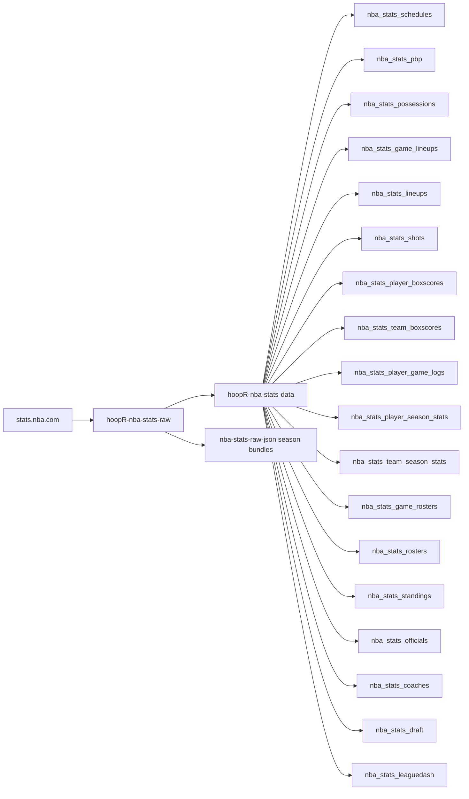
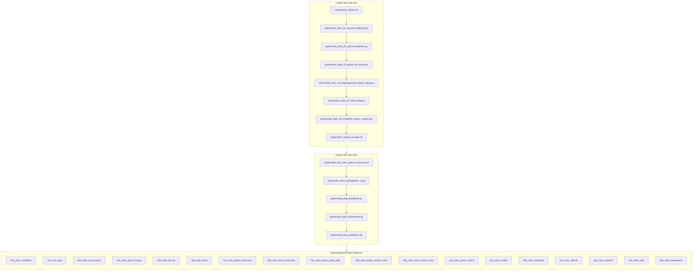

# hoopR-nba-stats-raw

Raw cache of NBA Stats API (`stats.nba.com`) JSON. The scrapers here fill
`nba_stats/json/` — per-game payloads (`{endpoint}/{season}/{game_id}.json`),
season-level payloads (`{endpoint}/{season}/{variant}.json` or flat
`{endpoint}/{season}.json`), and per-period boxscores — and commit them to
git, one commit per season. The sibling `hoopR-nba-stats-data` compiles and
releases; it reads this tree and never writes it. Per-season tarballs of the
store are published as GitHub Release assets under the `nba-stats-raw-json`
tag (`.bundles/nba_stats_json_YYYY.tar.gz`).

Seasons are labelled by **END year**: `1996` = 1995-96, `2026` = 2025-26.

## hoopR NBA Stats workflow diagram





`scripts/daily_refresh.sh` (raw, droplet cron) and
`scripts/daily_nba_stats_python_processor.sh` (data) are the drivers; the raw side
also publishes whole-season JSON bundles to its own `nba-stats-raw-json` release.
Stage numbers are intended build order, not run order.

[hoopR-mbb-raw repository (source: ESPN)](https://github.com/sportsdataverse/hoopR-mbb-raw)

[hoopR-mbb-data repository (source: ESPN)](https://github.com/sportsdataverse/hoopR-mbb-data)

[hoopR-nba-raw repository (source: ESPN)](https://github.com/sportsdataverse/hoopR-nba-raw)

[hoopR-nba-data repository (source: ESPN)](https://github.com/sportsdataverse/hoopR-nba-data)

[hoopR-nba-stats-raw repository (source: NBA Stats)](https://github.com/sportsdataverse/hoopR-nba-stats-raw)

[hoopR-nba-stats-data repository (source: NBA Stats)](https://github.com/sportsdataverse/hoopR-nba-stats-data)

[ncaa-mbb-hoops-raw repository (source: stats.ncaa.org)](https://github.com/sportsdataverse/ncaa-mbb-hoops-raw)

[ncaa-mbb-hoops-data repository (source: stats.ncaa.org)](https://github.com/sportsdataverse/ncaa-mbb-hoops-data)

[hoopR-kp-data repository (source: KenPom, dormant)](https://github.com/sportsdataverse/hoopR-kp-data)

## Setup

```sh
uv sync --dev            # this repo's own .venv (sportsdataverse + curl_cffi)
uv run pytest            # offline unit tests, no network
```

Scrape drivers resolve the interpreter via `scripts/_venv.sh` (override with
`NBA_VENV_PYTHON`) — they deliberately do NOT use `uv run`, which would resync
the venv under a running sweep. Scrapes need ProxyBonanza creds
(`PROXY_ENDPOINT` / `PROXY_KEY` / `PROXY_PKG`): the backfill and repair
drivers read them from `~/.Renviron`; the droplet cron sources
`~/.config/sdv/env`. Values are never echoed or committed.

**Run scrapes from a residential IP only** — stats.nba.com *hangs* (never
errors) on datacenter/cloud IPs.

## Run order

Daily flow (runs unattended on the sdv-data **droplet cron**, not GitHub
Actions — deploy details in
`hoopR-nba-stats-data/scripts/P0_DROPLET_RUNBOOK.md`):

```sh
bash scripts/daily_refresh.sh    # current END-year season sweep, then commit+push
```

Backfill flow (manual, in your own terminal):

```sh
bash scripts/backfill.sh 1996:2026        # cold backfill (default range)
SCRAPE_WORKERS=4 bash scripts/backfill.sh # gentler pace

# long ranges: crash-restart wrapper under tmux, + commit loop alongside
tmux new-session -d -s sweepsup 'bash ops/supervise_sweep.sh 1996:2026'
bash ops/commit_loop.sh <launcher_pid>              # commit seasons as they finish

bash ops/commit_raw_json.sh                         # stage+commit+push, one commit/season
bash ops/publish_season_bundles.sh                  # refresh .bundles/ release assets
```

Repair flow (recurring — run after any large sweep):

```sh
bash ops/refill_empty_payloads.sh --check           # census of empty {} captures, no network
bash ops/refill_empty_payloads.sh                   # delete + refetch exactly those
bash ops/refill_empty_payloads.sh 2015:2026         # or a season range / --endpoint <slug>
```

Watch a running job live:

```sh
tail -f "$(ls -t logs/nba_stats_raw_backfill_*.log | head -1)"   # backfill
tail -f logs/nba_stats_20_refill_empty.log                                    # repair
tail -f "$(ls -t logs/watchdog_*.log | head -1)"                 # supervisor
```

Pace/behavior tuning is env-only: `SCRAPE_WORKERS`,
`SDV_PY_NBA_STATS_TIMEOUT`, `HEARTBEAT_SECS`, `SESSION_MAX_REQUESTS`,
`SESSION_MAX_SECS`, `SESSION_SERVER_ERR_RETRIES` (see `CLAUDE.md` for the
full table and defaults).

## Resume story

Every stage is idempotent and re-runnable:

- **Sweeps** resume by presence: payloads already on disk are skipped, so
  Ctrl-C + rerun only fetches what's missing. Writes are atomic
  (tmp + rename); `*.json.tmp` is gitignored.
- **supervise_sweep.sh** relaunches a died sweep (each restart resumes),
  stops cleanly on "sweep complete", and gives up after `MAX_RESTARTS` so a
  real crash loop surfaces.
- **commit_raw_json.sh / commit_loop.sh** are safe to re-run any time: only
  seasons with new or changed files produce a commit. The commit subject
  `NBA Stats Update (Start: YYYY End: YYYY)` is load-bearing — keep it
  verbatim.
- **Repair** exists because resume-by-presence has one blind spot: a payload
  persisted empty (`{}`) blocks its own refetch forever. The write guard now
  refuses empty payloads; `refill_empty_payloads.sh` repairs files already on
  disk. Deleted files are tracked in git, so `git checkout -- nba_stats/`
  undoes a bad run.

## Repository layout

<!-- BEGIN GENERATED: layout -->

```
hoopR-nba-stats-raw/
├── logs/   # per-run logs (gitignored where large)
├── nba_stats/
│   └── json/
├── ops/   # cron definitions and runbooks
│   ├── commit_loop.sh
│   ├── commit_raw_json.sh
│   ├── publish_season_bundles.sh
│   ├── refill_empty_payloads.sh
│   └── supervise_sweep.sh
├── python/   # Python pipeline stages, numbered in build order
│   ├── hoopr_nba_stats_raw_scrape.egg-info/
│   ├── nba_stats_raw_scrape/
│   ├── nba_stats_01_season_endpoints.py
│   ├── nba_stats_02_game_endpoints.py
│   ├── nba_stats_03_period_boxscores.py
│   ├── nba_stats_10_leaguegamelog_player_topup.py
│   ├── nba_stats_20_refill_empty.py
│   └── nba_stats_99_schedule_master_creation.py
├── scripts/   # bash drivers (the daily/weekly entry points)
│   ├── pipeline/
│   ├── _venv.sh
│   ├── backfill.sh
│   ├── daily_refresh.sh
│   └── run_pipeline.sh
└── tests/   # test suite
    ├── test_endpoint_floor.py
    ├── test_period_count_from_disk.py
    ├── test_schedule_master.py
    ├── test_scraper_wiring.py
    ├── test_season_capture.py
    ├── test_targeted_game_ids.py
    └── test_twin_consistency.py
```

<!-- END GENERATED: layout -->

## Reports & explainers

<!-- BEGIN GENERATED: reports -->

| Report | What it is | Last updated |
|---|---|---|
| _none yet_ | — | — |

<!-- END GENERATED: reports -->

## Automation & status

<!-- BEGIN GENERATED: status -->

| workflow | schedule | last run |
|---|---|---|
| [](https://github.com/sportsdataverse/hoopR-nba-stats-raw/actions/workflows/orphan_scripts.yml) | on push / dispatch | 2026-08-27 |
| [](https://github.com/sportsdataverse/hoopR-nba-stats-raw/actions/workflows/tests.yml) | on push / PR / dispatch | 2026-08-28 |

| release tag | assets | size | last publish |
|---|---:|---:|---|
| [`nba-stats-raw-json`](https://github.com/sportsdataverse/hoopR-nba-stats-raw/releases/tag/nba-stats-raw-json) | 31 | 1,482.2 MB | 2026-07-28 |

<!-- END GENERATED: status -->

## Consumers

The packages that read what this repo produces:

- **R:** [hoopR](https://hoopR.sportsdataverse.org) — docs at <https://hoopR.sportsdataverse.org>
- **Python:** [`sportsdataverse.nba (raw-store backend)`](https://github.com/sportsdataverse/sportsdataverse-py) — docs at <https://py.sportsdataverse.org>

## Stage inventory

Every numbered pipeline stage in `python/` (auto-listed; run subsets with the `scripts/*.sh` drivers by number or name):

- `python/nba_stats_01_season_endpoints.py`
- `python/nba_stats_02_game_endpoints.py`
- `python/nba_stats_03_period_boxscores.py`
- `python/nba_stats_10_leaguegamelog_player_topup.py`
- `python/nba_stats_20_refill_empty.py`
- `python/nba_stats_99_schedule_master_creation.py`
